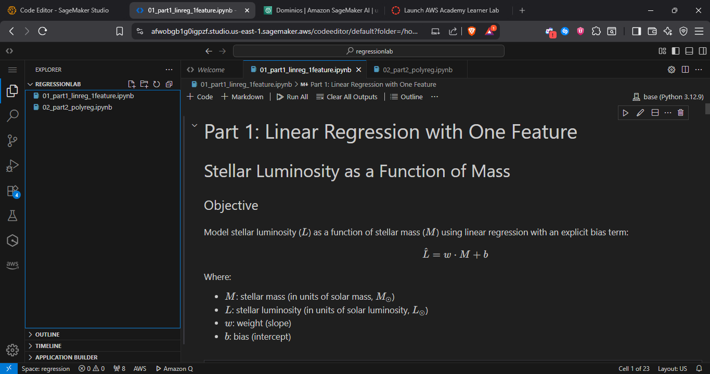
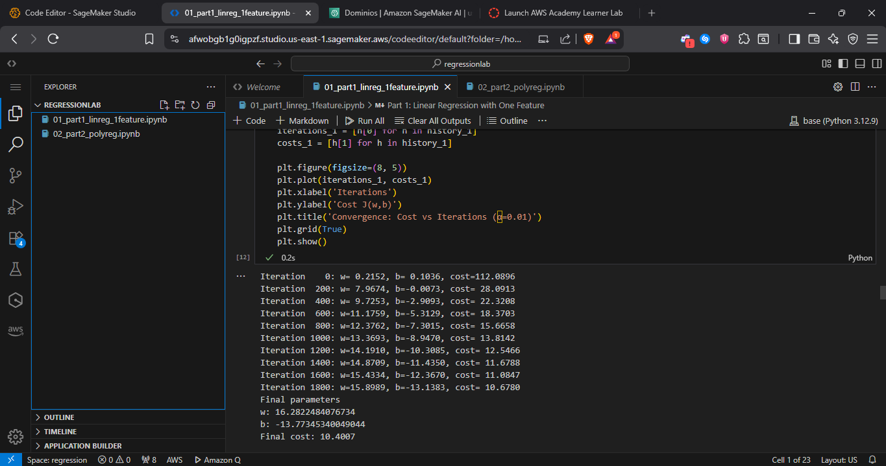
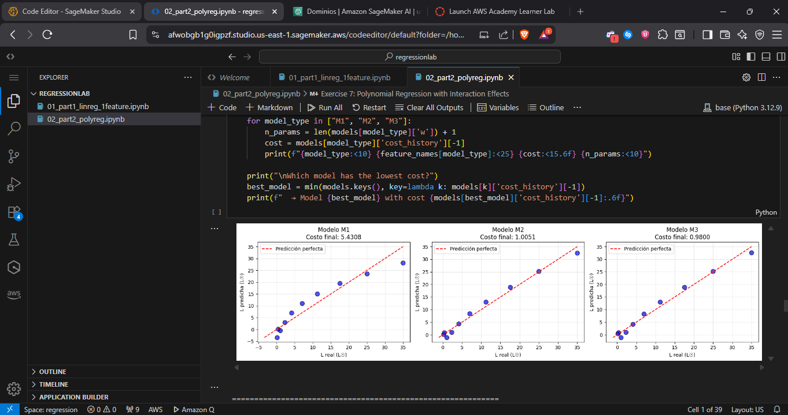

# Lab 01 - Linear and Polynomial Regression Machine Learning

This laboratory implements and analyzes simple linear regression and polynomial regression models using Python and Machine Learning libraries. The project includes data analysis, visualizations, model performance comparisons, and cloud deployment evidence on AWS SageMaker.

## Getting Started

These instructions will get you a copy of the project up and running on your local machine for development and testing purposes. See deployment section for notes on how to deploy the project on AWS SageMaker.

### Prerequisites

You need to have Python 3.8 or higher and pip (Python package manager) installed on your system.

```
Python 3.8+
pip (Python package manager)
Jupyter Notebook
```

### Installing

A step by step series of examples that tell you how to get a development environment running.

First, clone or download this repository to your local machine.

```bash
cd Lab01TDSE
```

Install the required Python libraries:

```bash
pip install numpy pandas matplotlib seaborn scikit-learn jupyter
```

Start Jupyter Notebook:

```bash
jupyter notebook
```

Open and execute the notebooks in the following order:

1. `01_part1_linreg_1feature.ipynb` - Simple linear regression
2. `02_part2_polyreg.ipynb` - Polynomial regression

End with running all cells in each notebook to see data visualizations, model outputs, and performance metrics (MSE, R²).

## Running the tests

The notebooks contain inline tests and validations for each regression model.

### Break down into end to end tests

Each notebook includes validation cells that test:

- Data loading and preprocessing correctness
- Model training and prediction functionality
- Metric calculations (MSE, R² score)
- Visualization rendering

```python
# Example: Testing model performance in the notebooks
from sklearn.metrics import mean_squared_error, r2_score
mse = mean_squared_error(y_true, y_pred)
r2 = r2_score(y_true, y_pred)
print(f"MSE: {mse:.4f}, R²: {r2:.4f}")
```

### And coding style tests

The code follows PEP 8 Python style guidelines and includes comments for clarity.

```python
# Example: Well-documented function
def train_linear_model(X, y):
    """Train a linear regression model."""
    model = LinearRegression()
    model.fit(X, y)
    return model
```

## Deployment

### AWS SageMaker Deployment Evidence

This section documents the deployment and execution of the notebooks on AWS SageMaker, as required for cloud evidence.

#### Upload Process Description

The notebooks were uploaded to AWS SageMaker following these steps:

1. **Access AWS SageMaker Console**:
   - Logged into AWS Management Console
   - Navigated to Amazon SageMaker > Notebook > Notebook instances

2. **Instance Creation/Access**:
   - Used a SageMaker Notebook instance (ml.t3.medium or similar)
   - Opened JupyterLab from the instance dashboard

3. **File Upload**:
   - Uploaded both notebooks via JupyterLab's upload interface
   - Verified all dependencies were available in the environment

4. **Execution**:
   - Executed each cell sequentially
   - Verified that outputs and plots were generated correctly

#### Screenshots Evidence

##### 1. Notebooks Visible in SageMaker


_Both notebooks loaded and visible in the SageMaker JupyterLab interface_

##### 2. Successful Execution - Linear Regression


_Linear regression notebook executed with all cells and outputs visible_

##### 3. Successful Execution - Polynomial Regression


_Polynomial regression notebook executed showing results and metrics_

##### 4. Plot Visualization


_Example of plots rendered correctly in SageMaker (linear/polynomial regression)_

#### Local vs SageMaker Execution Comparison

| Aspect             | Local Execution                           | AWS SageMaker                                     |
| ------------------ | ----------------------------------------- | ------------------------------------------------- |
| **Initial Setup**  | Manual library installation required      | Pre-configured environment with common libraries  |
| **Performance**    | Depends on local hardware                 | Scalable instances based on needs                 |
| **Execution Time** | Varies based on local CPU/RAM             | Consistent and predictable                        |
| **Collaboration**  | Limited to local team                     | Easy to share and collaborate in the cloud        |
| **Cost**           | No additional cost (uses local resources) | Pay-per-use pricing for instance time             |
| **Visualizations** | Immediate local rendering                 | Browser-based rendering (may have slight latency) |

#### Specific Observations

**Differences observed during execution**:

1. **Response Time**:
   - SageMaker showed similar execution times for small datasets
   - Network latency may affect interactivity in simple cells

2. **Libraries and Dependencies**:
   - All necessary libraries (NumPy, Pandas, Matplotlib) were pre-installed in SageMaker
   - No additional package installation was required

3. **Visualizations**:
   - Plots rendered correctly in both environments
   - In SageMaker, inline plots displayed without additional configuration

4. **Compatibility**:
   - No compatibility issues were encountered
   - Code was 100% portable between both environments

## Built With

- [Python](https://www.python.org/) - Programming language
- [NumPy](https://numpy.org/) - Numerical computing and array operations
- [Pandas](https://pandas.pydata.org/) - Data manipulation and analysis
- [Matplotlib](https://matplotlib.org/) - Data visualization
- [Seaborn](https://seaborn.pydata.org/) - Statistical data visualization
- [Scikit-learn](https://scikit-learn.org/) - Machine Learning library
- [Jupyter Notebook](https://jupyter.org/) - Interactive development environment
- [AWS SageMaker](https://aws.amazon.com/sagemaker/) - Cloud ML platform

## Authors

- **[Santiago Carmona Pineda]**

## License

This project is part of an academic laboratory assignment.

## Acknowledgments

- Course: TDSE (Transformación Digital y Soluciones Empresariales)
- University: [Escuela Colombiana de Ingeniería Julio Garavito]
- Program: [Systems Engineering]
- Thanks to instructors and teaching assistants for guidance
